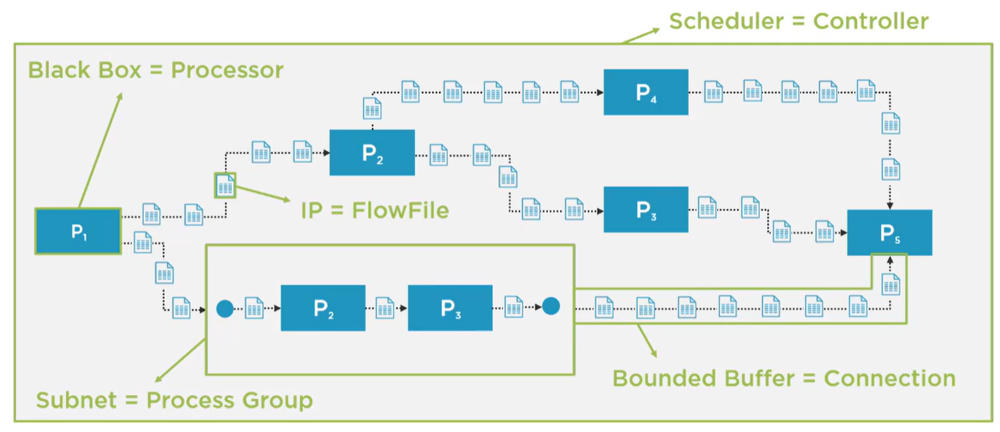

# Overview

## Introducing Apache NiFi

Apache NiFi is an easy to use, powerful, and reliable system to process and distribute data.

Top Key Features

- Flow management
- Push and pull models
- Ease of use
- Data provenance
- Security
- Extensible architecture
- Flexible in scaling

### Dataflow Management


### Big Data Integration with Apache Nifi

Volume

- Cluster Setup
- Parallelism
- Custom settings

Velocity

- Asynchrony
- Data buffering
- Memory usage

Variety

- Pre-built components
- Custom components
- Many default formats

Veracity

- Tracking & Cleansing
- Repositories
- Guaranteed Delivery

### Apache NiFi as a Dataflow System

| Good For                            | NOT good for                                                  |
| ----------------------------------- | ------------------------------------------------------------- |
| Stream processing                   | Batch processing                                              |
| Data transfer and delivery          | Distributed computations                                      |
| Handling data-in-motion             | Handling huge bulks of data                                   |
| Routing, filtering and transforming | Complex event processing, joins and rolling window operations |

## Architecture and Core Concepts of Apache NiFi

### Mapping Concepts of Flow Based Programming to Apache NiFi



| Flow-based     | Apache NiFi   |
| -------------- | ------------- |
| Black box      | Processor     |
| Scheduler      | Controller    |
| IP             | FlowFile      |
| Subnet         | Process Group |
| Bounded Buffer | Connection    |

### Apache NiFi's Environment and Architecture


### Apache NiFi Main Components


#### FlowFile

- Creation and adding content
- Data chunk moving through the system
- Attributes
  - System and user-defined attributes
  - Metadata in key/value pairs
- Content
  - Pointing to actual data
  - Data stored in Content Repository

#### Processor


- Configurable component written in Java
- Accessing attributes and content of FlowFiles and performing operations
- High-level abstraction fulfilling a task
- 300 pre-built processors available in 1.9
- Development of custom processors
- Individual scaling configurations

#### Process Groups


- Grouping and nesting processors and their connections
- Interacting with other layers
- Defining input and output ports
- Beneficial in maintaining flows

#### Connections


- Connecting processors and process groups
- Queuing and buffering between processors
- Defining threshold and applying backpressure
- Prioritizing FlowFiles (default FIFO)

#### Controller


- The brain of the operation
- Managing dataflow
- Keeping record of all applied components
- Allocating and managing threads
- Adding services for sharing resources among processors
  - Database connections
  - SSL certificates

### FlowFile Lifecycle and Repositories


### Clustering Apache NiFi


## Environments

### VM

Prerequisites:

- Vagrant
- VirtualBox
- Vagrant Plugins

    ```bash
    vagrant plugin install vagrant-docker-compose
    ```

## References

[Running Nifi in a Docker Container](https://nathanlabadie.com/running-nifi-in-a-docker-container/)

[Using volumes with rootles podman, explained](https://www.tutorialworks.com/podman-rootless-volumes/)